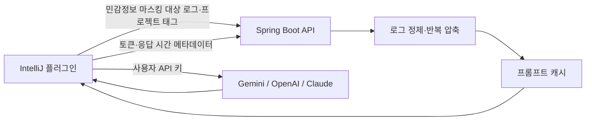

# Error Purifier

IntelliJ IDEA에서 발생한 오류 로그를 정제하고, 사용자가 선택한 LLM으로 분석하도록 돕는 로컬 개발 도구입니다. 반복 재시도 로그와 프레임워크 노이즈를 줄여 불필요한 프롬프트 비용을 낮추고, 분석 근거와 사용량을 함께 보여 줍니다.

## 구성



- 백엔드는 로그 정제, 반복 압축, 캐시, 사용량과 품질 지표를 담당합니다.
- 실제 LLM 호출과 API 키 보관은 사용자의 IntelliJ에서 수행합니다.
- 일반 사용량 기록에는 원본 로그나 AI 답변 본문을 저장하지 않습니다. 감사 로그 기능으로 보내는 로그는 서버에서 다시 마스킹됩니다.

## 주요 기능

- 선택 로그 또는 콘솔 전체 로그 정제
- API 키, 비밀번호, Bearer 토큰, private key 등의 민감정보 마스킹
- 연속 반복 로그 압축: 첫 2개와 마지막 1개를 보존하고 중간 반복을 요약
- 타임스탬프 기반 재시도 로그와 타임스탬프 없는 예외 블록 반복 지원
- Gemini, OpenAI, Claude 스트리밍 분석 및 빠른/정밀/심층 분석 모드
- 근거 로그 줄 인용, 실제 입력·출력·추론 토큰 및 응답 시간 표시
- 프롬프트 캐시와 사용자 피드백 기반 품질 추적
- 관리자 플레이북: 자주 발생하는 오류의 점검 가이드를 AI 프롬프트에 추가
- 관리자 대시보드: 캐시 적중률, 반복 압축 절감량, 플레이북 적용량, 정제 품질 피드백 확인

## 반복 로그 압축

재시도 폭풍처럼 같은 오류 블록이 연속될 때, 단순 줄 삭제 대신 진단에 필요한 앞·뒤 정보를 남깁니다.

```text
[첫 번째 재시도 블록]
[두 번째 재시도 블록]
[... 유사한 반복 로그 블록 47회 중 44회 생략: 첫 2개와 마지막 1개 보존 ...]
[마지막 재시도 블록]
```

타임스탬프, 재시도 번호, UUID, 지연 시간 등 매번 달라지는 값은 **반복 판별용 서명에서만** 정규화합니다. 로그 본문에는 실제 첫·마지막 값을 그대로 남깁니다. 서로 번갈아 나오는 비연속 이벤트는 시간 흐름을 보존하기 위해 합치지 않습니다.

## 실행

### 요구 사항

- Java 21
- MariaDB
- IntelliJ 플러그인 프로젝트는 별도로 JDK 17 필요

개발 환경은 `.env.example`을 참고해 DB 환경변수를 설정합니다.

```bash
./gradlew bootRun
```

테스트와 실행 JAR 빌드:

```bash
./gradlew test bootJar
```

## CI

GitHub Actions는 push와 pull request마다 Java 21 환경에서 `./gradlew test bootJar`를 실행합니다. 실행 JAR과 테스트가 함께 통과해야 변경을 병합할 수 있습니다.

## IntelliJ 플러그인

플러그인 프로젝트는 별도 `error-purifier-plugin` 저장소로 관리합니다.

1. 백엔드를 실행합니다.
2. IntelliJ 설정의 `Tools > AI Error Purifier`에서 백엔드 URL, 제공자, 모델, API 키를 설정합니다.
3. 콘솔에서 오류 로그를 선택하고 컨텍스트 메뉴의 `에러 로그 AI 분석 (비용 최적화)`을 실행합니다.
4. 결과 도구 창에서 `AI 답변`, `정제 로그`, `내 사용량` 탭을 확인합니다.

`정제 로그` 탭에는 AI에 전달된 마스킹·압축 완료 로그가 표시됩니다. `내 사용량` 탭에는 실제 API 토큰, 응답 시간, 누적 반복 로그 압축 절감량이 표시됩니다.

## 관리자 화면

백엔드 실행 후 `http://localhost:8080/admin/`에서 접속합니다. `ERROR_PURIFIER_ADMIN_TOKEN`과 같은 값을 입력해야 데이터를 조회하거나 변경할 수 있습니다.

- 플레이북 추가·수정·활성화·비활성화
- 저장 전 Java 정규식 문법 및 샘플 로그 매칭 검사
- 활성 플레이북 전체 매칭 미리보기
- 플레이북별 실제 적용 횟수
- 운영 대시보드와 정제 품질 피드백

관리자 토큰은 브라우저 저장소에 저장하지 않습니다.

## 검증 범위

자동 테스트는 다음을 포함합니다.

- Flyway V1~V4 마이그레이션과 JPA 매핑
- 디바이스 인증, 프롬프트 준비, 관리자 API 권한
- 플레이북 CRUD·미리보기·적용 횟수
- 반복 Redis/Kafka 재시도 블록과 타임스탬프 없는 예외 블록 압축
- 반복 압축 절감량 사용량 집계

## 참고 문서

- API 세부 목록과 운영 환경변수: [HELP.md](HELP.md)
- 플러그인 빌드·설치: `error-purifier-plugin` 저장소의 README
