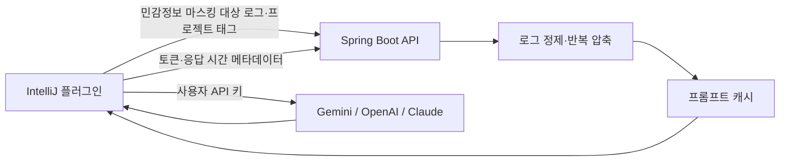

# Error Purifier

IntelliJ IDEA에서 발생한 오류 로그를 정제하고, 사용자가 선택한 LLM으로 분석하도록 돕는 로컬 개발 도구입니다. 반복 재시도 로그와 프레임워크 노이즈를 줄여 불필요한 프롬프트 비용을 낮추고, 분석 근거와 사용량을 함께 보여 줍니다.

<a id="self-hosted-quick-start"></a>

## 셀프 호스팅 빠른 시작

비용 없이 실행하는 포트폴리오 기본 구성은 Spring Boot 백엔드와 MariaDB를 Docker Compose로 로컬에서 실행합니다. macOS 또는 Windows에서는 [Docker Desktop](https://www.docker.com/products/docker-desktop/)을, Linux에서는 Compose 플러그인이 포함된 Docker Engine을 설치하세요.

1. 이 저장소를 복제하고 저장소 디렉터리로 이동합니다.
2. 로컬 환경변수 파일을 생성합니다.

   macOS/Linux:

   ```bash
   cp .env.example .env
   ```

   Windows PowerShell:

   ```powershell
   Copy-Item .env.example .env
   ```

3. `.env`의 모든 `replace-me` 값을 교체합니다. 비밀번호와 토큰마다 서로 다른 강한 랜덤 값을 생성하세요.

   macOS/Linux:

   ```bash
   openssl rand -base64 32
   ```

   Windows PowerShell:

   ```powershell
   $bytes = New-Object byte[] 32
   $rng = [Security.Cryptography.RandomNumberGenerator]::Create()
   try {
       $rng.GetBytes($bytes)
       [Convert]::ToBase64String($bytes)
   } finally {
       $rng.Dispose()
   }
   ```

4. MariaDB와 백엔드를 빌드하고 실행합니다.

   ```bash
   docker compose up --build
   ```

5. 다른 터미널에서 상태 확인 API가 `UP`을 반환하는지 확인합니다.

   macOS/Linux:

   ```bash
   curl http://localhost:8080/api/v1/health
   ```

   Windows PowerShell:

   ```powershell
   Invoke-RestMethod http://localhost:8080/api/v1/health
   ```

   예상 응답은 `{"status":"UP"}`입니다. IntelliJ 플러그인의 백엔드 URL을 `http://localhost:8080`으로 설정하세요.

데이터베이스 데이터를 유지하면서 컨테이너를 종료합니다.

```bash
docker compose down
```

> **데이터 영구 삭제 주의:** `docker compose down -v`는 MariaDB named volume과 그 안의 디바이스, 캐시, 사용량, 피드백, 요청 이력, 플레이북을 모두 삭제합니다. 백업이 없다면 복구할 수 없습니다.

Compose는 백엔드를 기본적으로 `127.0.0.1`에만 바인딩하고 MariaDB 포트를 호스트에 공개하지 않습니다. 이 구성은 로컬 평가용이며 인터넷에 직접 노출하는 운영 배포용이 아닙니다. 셀프 호스팅 운영자는 HTTPS 종단, 인증과 네트워크 접근 제어, 비밀값 교체, 데이터베이스 백업과 복구 테스트, 모니터링, 보존 기간, 삭제 요청을 직접 관리해야 합니다. 이러한 통제가 준비되기 전에는 `BACKEND_BIND_ADDRESS`를 변경해 백엔드를 외부에 노출하지 마세요.

애플리케이션은 JVM 기본 시간대, Hibernate JDBC 처리 시간대, Compose 컨테이너 시간대를 UTC로 통일합니다. Docker를 사용하지 않고 IntelliJ에서 백엔드를 직접 실행한 경우를 포함해 `DATETIME(6)` 칼럼에 저장된 값은 UTC로 해석해야 합니다.

### UTC 적용 이전 데이터 처리

이 변경은 이전 버전이 저장한 시간값을 자동으로 변환하지 않습니다. 포트폴리오 또는 개발 데이터베이스를 삭제해도 된다면 필요한 데이터를 먼저 백업한 뒤 다시 생성할 수 있습니다. Compose에서 `docker compose down -v`를 실행하면 데이터베이스 볼륨과 모든 데이터가 영구 삭제되므로 데이터 손실을 감수할 수 있을 때만 실행하고, 이후 `docker compose up --build`로 다시 시작하세요.

데이터를 보존해야 한다면 검증된 백업을 만들고 과거 레코드가 실제로 기록된 원본 시간대를 확인한 뒤, 복사본에서 검토된 수동 변환 절차를 사용하세요. 무조건 9시간을 빼면 안 됩니다. 과거 Docker 백엔드가 저장한 레코드는 이미 UTC일 수 있고, 로컬 JVM이 저장한 레코드는 다른 시간대를 사용할 수 있습니다. 현재 Flyway 마이그레이션은 기존 시간 데이터를 변환하지 않습니다.

## 구성



- 백엔드는 로그 정제, 반복 압축, 캐시, 사용량과 품질 지표를 담당합니다.
- 실제 LLM 호출과 API 키 보관은 사용자의 IntelliJ에서 수행합니다.
- 일반 사용량 기록에는 원본 로그나 AI 답변 본문을 저장하지 않습니다. 현재 IntelliJ 플러그인의 일반 분석 흐름은 별도의 감사 로그 API를 호출하지 않습니다.

## 주요 기능

- 선택 로그 또는 콘솔 전체 로그 정제
- 최대 1,000,000자의 콘솔 로그 수신 후 민감정보 마스킹·반복 압축·오류 중심 구간 추출(LLM용 정제 로그는 최대 12,000자)
- API 키, 비밀번호, Bearer 토큰, private key 등의 민감정보 마스킹
- 연속 반복 로그 압축: 첫 2개와 마지막 1개를 보존하고 중간 반복을 요약
- 타임스탬프 기반 재시도 로그와 타임스탬프 없는 예외 블록 반복 지원
- Gemini, OpenAI, Claude 스트리밍 분석 및 빠른/정밀/심층 분석 모드
- 근거 로그 줄 인용, 실제 입력·출력·추론 토큰 및 응답 시간 표시
- IDE 종료 코드 같은 실행 환경 문구를 별도 태깅해 단독 오류 근거로 쓰지 않도록 제한
- 답변의 누락된 근거 인용과 정상 응답 로그에 상충하는 크래시 서술을 경고로 표시
- 프롬프트 캐시와 사용자 피드백 기반 품질 추적
- 관리자 플레이북: 자주 발생하는 오류의 점검 가이드를 AI 프롬프트에 추가
- 관리자 대시보드: 캐시 적중률, 반복 압축 절감량, 플레이북 적용량, 정제 품질 피드백 확인

## 반복 로그 압축

재시도 폭풍처럼 같은 오류 블록이 연속될 때, 단순 줄 삭제 대신 진단에 필요한 앞·뒤 정보를 남깁니다.

```text
[첫 번째 재시도 블록]
[두 번째 재시도 블록]
[... 유사한 반복 로그 블록 47회 중 44회 생략: 첫 2개와 마지막 1개 보존 ...]
[마지막 재시도 블록]
```

타임스탬프, 재시도 번호, UUID, 지연 시간 등 매번 달라지는 값은 **반복 판별용 서명에서만** 정규화합니다. 로그 본문에는 실제 첫·마지막 값을 그대로 남깁니다. 서로 번갈아 나오는 비연속 이벤트는 시간 흐름을 보존하기 위해 합치지 않습니다.

## 실행

### 요구 사항

- Java 21
- MariaDB
- IntelliJ 플러그인 프로젝트는 별도로 JDK 25 필요 (IntelliJ IDEA 2026.2 이상)

개발 환경에서는 IntelliJ의 `Run > Edit Configurations > Environment variables` 또는 운영 환경의 비밀 관리 기능에 아래 값을 직접 설정합니다.

| 이름 | 용도 |
| --- | --- |
| `DB_URL` | MariaDB 연결 URL |
| `DB_USERNAME` | DB 사용자명 |
| `DB_PASSWORD` | DB 비밀번호 |
| `ERROR_PURIFIER_ADMIN_TOKEN` | 관리자 화면용 별도 랜덤 토큰 |

로컬에서는 Git에서 제외된 `.env` 파일도 사용할 수 있습니다. IntelliJ 실행 환경변수와 운영 환경의 비밀 관리 기능에 설정한 값이 있으면 해당 값이 우선합니다. 비밀값이 든 `.env` 파일은 커밋하지 마세요.

Docker를 사용하는 셀프 호스팅 실행은 위의 [셀프 호스팅 빠른 시작](#self-hosted-quick-start)을 따르세요. Docker 없이 직접 실행하려면 MariaDB를 별도로 준비한 뒤 다음 명령을 사용합니다.

```bash
./gradlew bootRun
```

테스트와 실행 JAR 빌드:

```bash
./gradlew test bootJar
```

## CI

GitHub Actions는 push와 pull request마다 Java 21 환경에서 테스트와 실행 JAR 빌드를 수행하고, Docker Compose 설정과 Docker 이미지 빌드도 검증합니다. 테스트·JAR·컨테이너 빌드가 모두 통과해야 변경을 병합할 수 있으며, 성공한 실행의 JAR은 Actions artifact로 내려받을 수 있습니다.

## 상태 확인

`GET /api/v1/health`는 서버와 DB 연결이 준비되면 `200 {"status":"UP"}`를 반환합니다. DB에 연결할 수 없으면 내부 오류를 노출하지 않고 `503 {"status":"DOWN"}`을 반환합니다.

## IntelliJ 플러그인

플러그인 프로젝트는 별도 [error-purifier-plugin 저장소](https://github.com/Seongbin-Choo/error-purifier-plugin)로 관리합니다.

1. 백엔드를 실행합니다.
2. IntelliJ 설정의 `Tools > AI Error Purifier`에서 백엔드 URL, 제공자, 모델, API 키를 설정합니다.
3. 콘솔에서 오류 로그를 선택하고 컨텍스트 메뉴의 `에러 로그 AI 분석 (비용 최적화)`을 실행합니다.
4. 결과 도구 창에서 `AI 답변`, `정제 로그`, `내 사용량` 탭을 확인합니다.

`정제 로그` 탭에는 AI에 전달된 마스킹·압축 완료 로그가 표시됩니다. `내 사용량` 탭에는 실제 API 토큰, 응답 시간, 누적 반복 로그 압축 절감량이 표시됩니다.

## 개인정보 및 셀프 호스팅 운영 책임

이 백엔드는 중앙 운영 서비스가 아니라 사용자가 직접 배포하는 셀프 호스팅 구성요소입니다. 데이터베이스의 디바이스·캐시·사용량·피드백·요청 이력에는 자동 보존기한이나 자동 삭제 작업이 없으므로, 접근 통제·전송 보안·백업·보존 기간·삭제는 백엔드 운영자가 관리해야 합니다. 일반 프롬프트 준비 흐름은 제출된 원본 로그나 AI 답변 본문을 데이터베이스에 저장하지 않으며, 현재 IntelliJ 플러그인은 별도의 감사 로그 API를 호출하지 않습니다.

플러그인이 전송하는 정확한 데이터와 동의·철회 동작은 [플러그인 개인정보 처리방침](https://github.com/Seongbin-Choo/error-purifier-plugin/blob/main/PRIVACY.md)을 확인하세요.

## 관리자 화면

백엔드 실행 후 `http://localhost:8080/admin/`에서 접속합니다. `ERROR_PURIFIER_ADMIN_TOKEN`과 같은 값을 입력해야 데이터를 조회하거나 변경할 수 있습니다.

- 플레이북 추가·수정·활성화·비활성화
- 저장 전 Java 정규식 문법 및 샘플 로그 매칭 검사
- 활성 플레이북 전체 매칭 미리보기
- 플레이북별 실제 적용 횟수
- 운영 대시보드와 정제 품질 피드백

관리자 토큰은 브라우저 저장소에 저장하지 않습니다.

## 검증 범위

자동 테스트는 다음을 포함합니다.

- Flyway V1~V5 마이그레이션과 JPA 매핑
- 디바이스 인증, 프롬프트 준비, 관리자 API 권한
- 플레이북 CRUD·미리보기·적용 횟수
- 반복 Redis/Kafka 재시도 블록과 타임스탬프 없는 예외 블록 압축
- 반복 압축 절감량 사용량 집계
- 요청 이력 커서 페이징의 동점 정렬 처리(행 누락·중복 없음)와 잘못된 커서·size 거부

## 참고 문서

- API 세부 목록과 운영 환경변수: [HELP.md](HELP.md)
- 요청 이력 조회 성능 측정과 개선 근거: [docs/PERFORMANCE.md](docs/PERFORMANCE.md)
- 플러그인 빌드·설치: [error-purifier-plugin README](https://github.com/Seongbin-Choo/error-purifier-plugin#readme)
- 플러그인 데이터 흐름·보관·동의: [AI Error Log Purifier Privacy Policy](https://github.com/Seongbin-Choo/error-purifier-plugin/blob/main/PRIVACY.md)

## 라이선스

이 프로젝트는 [MIT License](LICENSE)로 배포됩니다.
